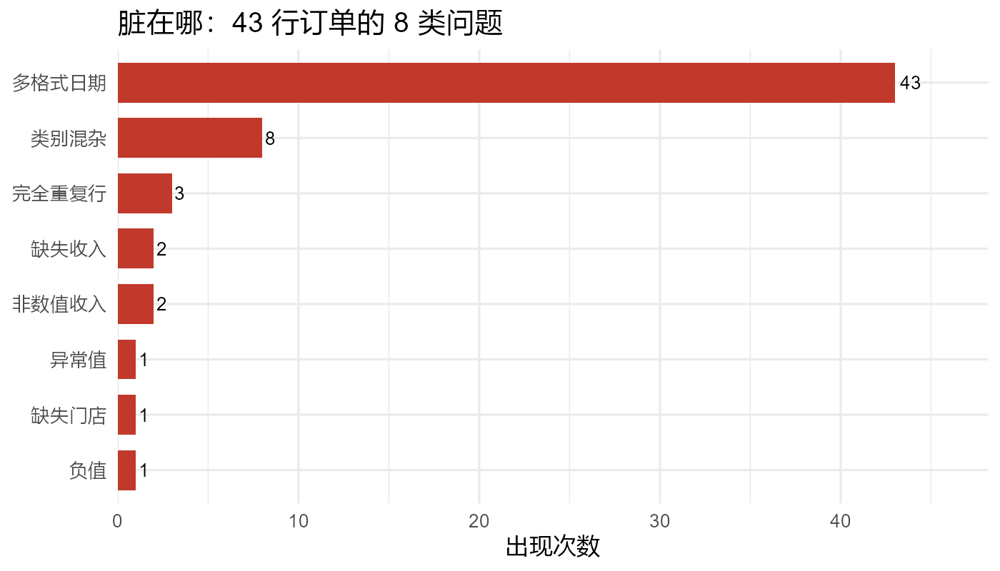

<sub>🌐 <b>中文</b></sub>

<div align="center">

# data-cleaning

> *「别再让 AI 一把梭把数据"洗"没了——先审计、后清洗、每一步可追溯。」*

[](SKILL.md)
[](https://www.tidyverse.org/)
[](LICENSE)

**把 43 行脏数据变成 40 行干净数据 + 7 步清洗日志 + 一份 PDF 质量报告——删了什么、改了什么、为什么，全都对得上账。**

[看效果](#效果示例) · [安装](#快速开始) · [触发方式](#触发方式) · [它和同类有什么不同](#它和同类有什么不同) · [安全边界](#安全边界)

</div>

---



<sub>真实运行产物：[examples/messy_sales.csv](examples/messy_sales.csv) → [examples/cleaning_report.pdf](examples/cleaning_report.pdf)</sub>

---

## 它解决什么问题

让 AI 清洗数据，最怕的不是洗不干净，是**它悄悄替你做了主**：删了 200 行"疑似异常"不吭声、把关键字段用均值填了、清洗脚本顺手覆盖了原始文件。等发现口径对不上，原始数据已经没了。

这个 skill 把清洗变成**对账**：动手前先交审计报告（缺失在哪、重复多少、离群几个、日期几种格式），高风险动作（删行、填补、N:N 连接）必须停下来等你拍板，每一步都写进清洗日志——前后行数、影响范围、你的决策，一行不少。

它也不是一份"方法论空文"：Windows 下 Rscript 的 BOM 坑、locale 坑、编码坑、`readr` 静默猜型的坑，全是真实踩过并写进坑表的；片段代码由 [scripts/verify_snippets.R](scripts/verify_snippets.R) 的 36 项回归测试保真。

## 效果示例

43 行故意做脏的销售数据（3 行重复、8 种类别写法、3 种日期格式、`¥1,234` 式文本收入、负值 + 离群值、缺失）：

```text
你：帮我清洗 examples/messy_sales.csv，出一份质量报告。

Agent：① 审计：43 行×5 列，缺失 3 处，完全重复 3 行，
        类别 8 种写法，日期 3 种格式，收入 2 处非数值。
     ② 逐项清洗（每步入日志）：列名 snake → 去重(-3) →
        日期统一 → ¥收入解析 → 类别归并(8→2) → 异常打标。
     ③ 异常只打标不删：1 负值 + 2 离群值，原值保留待复核。
     ④ 交付：40 行干净数据 + cleaning_log.csv（7 步）+
        cleaning_report.pdf（PrettyTypst 排版）。
```

跑一遍复现：

```bash
cd data-cleaning
Rscript --vanilla examples/run_showcase.R examples/messy_sales.csv   # 审计+清洗+日志+图
cd examples && quarto render cleaning_report.qmd                     # PDF 报告
```

> Git Bash 用户渲染前请 `env -u LC_CTYPE -u LANG -u LC_ALL quarto render ...`，
> 否则 R chunk 里的中文会被转义而解析失败（详见 SKILL.md 坑表）。

## 快速开始

**前提**：本 skill 生成 R 代码并驱动 `Rscript` 执行——本机需装 R（建议 ≥4.2，含 tidyverse、jsonlite）；要出 PDF 报告还需 Quarto CLI。二者缺一时 skill 仍能给出清洗代码，但无法直接执行/渲染。

把本目录复制进你的 Agent 技能目录（SKILL.md 形态，Claude Code / ZCode / OpenCode / Codex 通用）：

```bash
# 以 Claude Code 为例（目录按你的 runtime 调整）
cp -r data-cleaning ~/.claude/skills/
```

装完对 Agent 说：

```text
帮我清洗这份数据：先审计看看脏在哪，出个清洗方案再动手。
```

## 触发方式

- "帮我清洗这份数据 / 这表太脏了"
- "数据里有缺失值/重复行/异常值怎么办"
- "把这两张表合并一下"（会先诊断连接关系再 join）
- "日期格式乱七八糟，统一一下"
- "出一份数据质量报告"
- "这些列名乱码了，规范一下"

## 它会交付什么

| 能力 | 交付物 |
|---|---|
| 结构/缺失/重复/异常审计 | 审计摘要（行列数、缺失率、主键唯一性、取值范围） |
| 逐项清洗 | `*_cleaned` 数据（原始文件永不覆盖） |
| 全程追溯 | 结构化清洗日志（每步：规则/前后行数/影响/用户决策） |
| 连接诊断 | 1:1 / 1:N / N:1 / N:N 判定 + 膨胀行数验证 |
| 质量报告 | PrettyTypst 排版 PDF（中文无乱码，离线可渲染） |

## 它和同类有什么不同

| 维度 | 市面上多数清洗技能 | 本 skill |
|---|---|---|
| 技术栈 | Python / Stata / CLI 为主 | R tidyverse（`.by`、`\|>`、现代规范） |
| 动手前 | 直接开洗 | 先审计、高风险项必须暂停确认 |
| join 诊断 | 多数缺失 | 内置关系判定模板 + 行数膨胀验证 |
| 清洗日志 | 一句"记录决策" | 结构化 CSV，每步一行可对账 |
| 质量报告 | 少数承诺 | PrettyTypst PDF，真实实例入库 |
| 代码保真 | — | 36 项片段回归一键验证 |

## 安全边界

- **不会覆盖原始数据**：清洗结果一律 `*_cleaned` 另存。
- **不会静默删行**：异常值默认打 flag；删除/截尾必须说明规则并经确认。
- **会停下来问你**：主键不明、N:N 连接、口径冲突、大量缺失删除——你说"赶时间别问了"也不豁免。
- **不碰超大文件**（约 >200MB）：先建议 CSV/Parquet 中转。

## 文件结构

```text
├── SKILL.md                  技能本体：原则→协议→工作流→决策表→坑表
├── references/snippets.md    11 组即用片段（审计/去重/日期/异常/日志…）
├── scripts/verify_snippets.R 17 项一键回归（片段 + 模板 lint）
├── templates/                清洗报告骨架（PrettyTypst 格式）
├── examples/                 端到端示例：脏数据 + 脚本 + PDF 报告
└── _extensions/PrettyTypst   vendored 渲染扩展（CC0，含 CJK 字体链）
```

## 验证与测试

```bash
Rscript --vanilla scripts/verify_snippets.R
# [PASS] × 36，Summary: 36 check(s), 0 failure(s)，exit 0
```

行为测试见 [test-prompts.json](test-prompts.json)：含一条"我赶时间，能删的都删了"的对抗性
prompt——合格表现是拒绝绕过高风险确认，而不是照办。

## 致谢

- [PrettyTypst](https://github.com/nrennie/PrettyTypst)（Nicola Rennie，CC0）：报告排版扩展，本仓库 vendored 并补了 CJK 字体链
- 姊妹技能 `tidy-data`：数据思维 8 范式，清洗中涉及 reshape/分组/迭代时兜底
- 打磨方法来自鲁班工坊（验料 → 访行 → 过尺 → 慢刨）

## License

[MIT](LICENSE)
